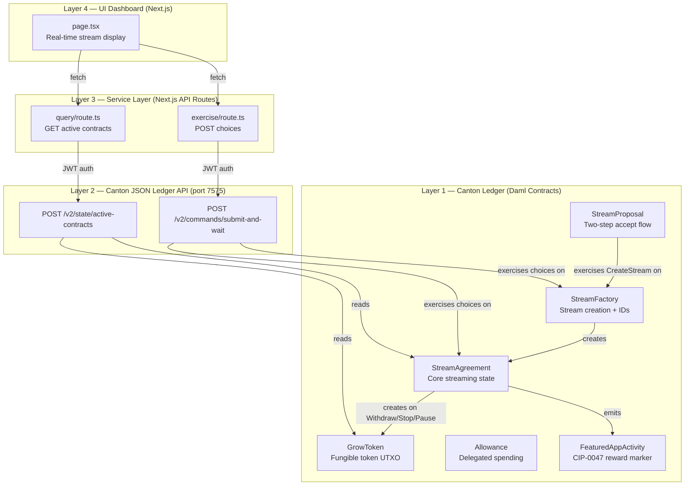
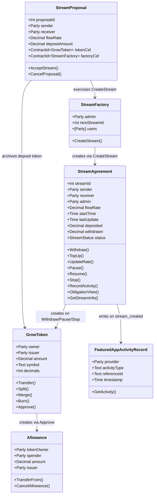
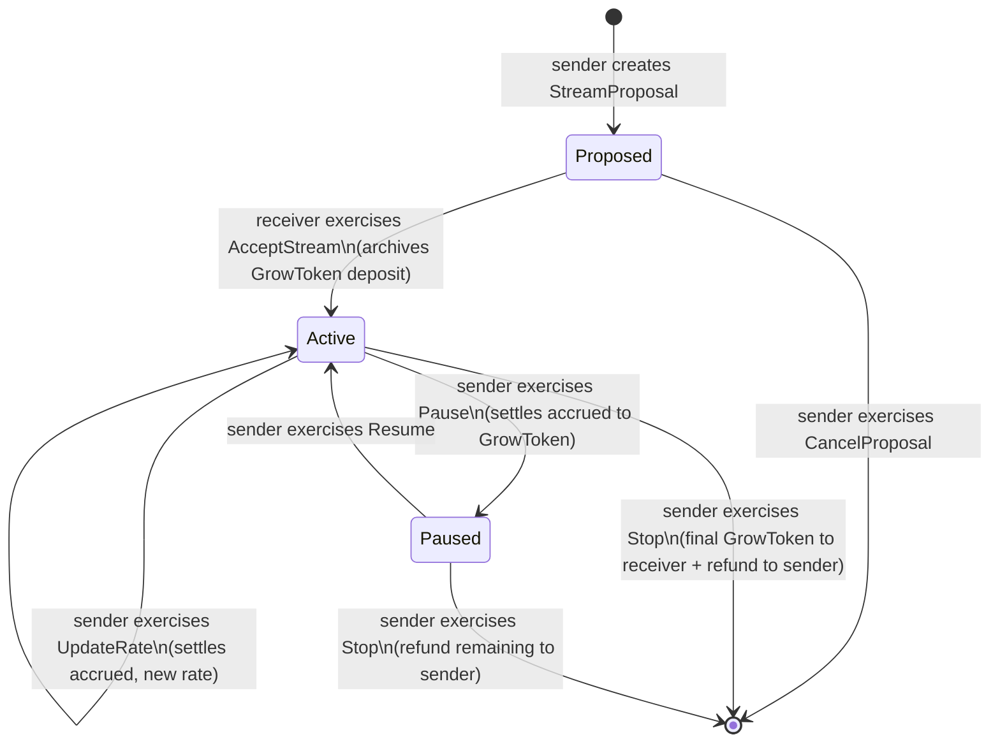
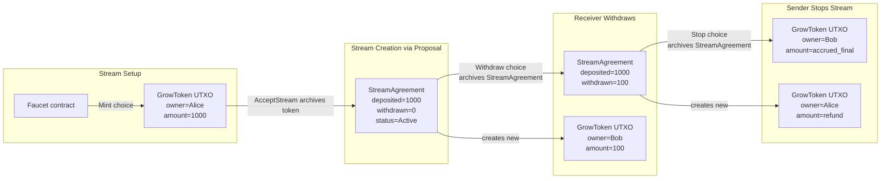
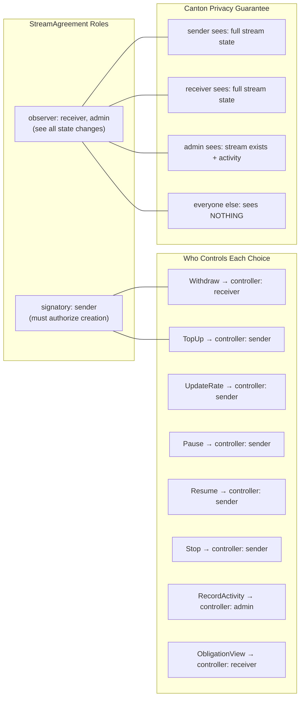
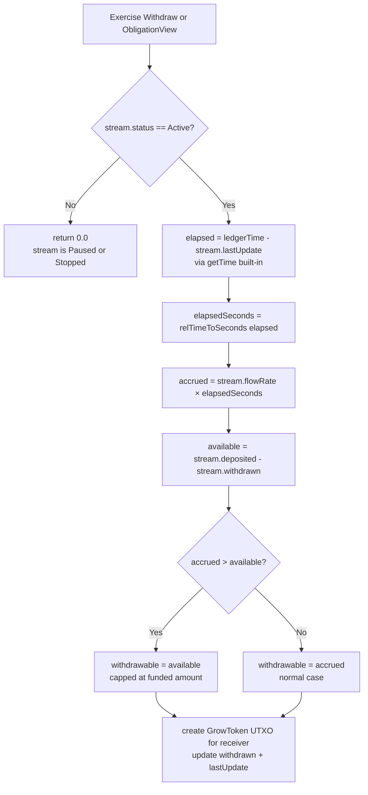
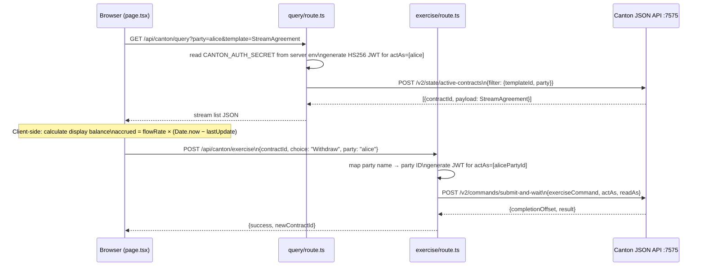
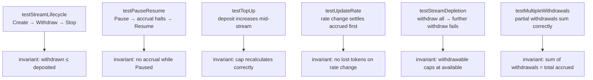
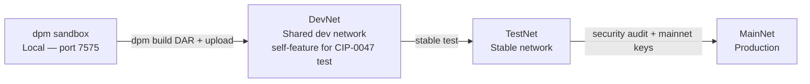

# GrowStreams — Real-Time Money Streaming on Canton Network

> **The per-second streaming payment primitive for Canton — the institutional equivalent of Superfluid, built privacy-first on Daml smart contracts.**

**SDK**: Canton 3.4 / DPM · **License**: MIT · **Network**: Sandbox → DevNet → TestNet

GrowStreams is a **privacy-first, per-second token streaming protocol** built natively on **Canton Network** using Daml smart contracts. It is the institutional equivalent of [Superfluid](https://docs.superfluid.org/) — turning fixed-schedule financial obligations into programmable real-time flows, with full sub-transaction privacy.

**Core identity**: not a payment app, not a wallet — a **low-level financial primitive** that other Canton applications compose on top of.

---

## Table of Contents

- [What is GrowStreams?](#what-is-growstreams)
- [Why Canton, not Ethereum?](#why-canton-not-ethereum)
- [System Architecture](#system-architecture)
- [Contract Model](#contract-model)
- [Stream Lifecycle](#stream-lifecycle)
- [Token Flow (UTXO Model)](#token-flow-utxo-model)
- [Multi-Party Authorization](#multi-party-authorization)
- [Accrual Engine](#accrual-engine)
- [Frontend & API Layer](#frontend--api-layer)
- [Project Structure](#project-structure)
- [Quick Start](#quick-start)
- [Running Tests](#running-tests)
- [Deployment](#deployment)
- [Roadmap](#roadmap)
- [Contributing](#contributing)

---

## What is GrowStreams?

Instead of:

```
"Send 1000 GROW today"
```

You do:

```
"Send 1000 GROW over 1000 seconds continuously at 1.0 GROW/second"
```

Money becomes a **function of time**. The formula is deterministic and enforced on-ledger:

```
accrued = flowRate × (ledgerTime − lastUpdate)
withdrawable = min(accrued, deposited − withdrawn)
```

### Use Cases

| Use Case | Flow Rate Example | Privacy Requirement |
|---|---|---|
| Payroll streaming | 0.000385 GROW/sec (~100/day) | Salary is private |
| LP incentive rewards | Proportional to pool share | Deal terms are private |
| Institutional billing | Per-API-call metering | Contract rates are private |
| Token vesting | Cliff + linear unlock | Cap table is private |
| B2B SaaS subscriptions | Monthly rate / seconds | Pricing is private |

---

## Why Canton, not Ethereum?

GrowStreams and Superfluid solve the same problem with fundamentally different models:

| Dimension | Superfluid (EVM) | GrowStreams (Canton) |
|---|---|---|
| State model | Account (mutable global) | UTXO (archive → create) |
| Balance | Formula on shared state | Field in private contract |
| Pre-funding | Not required (buffer + liquidators) | Required (escrow in contract) |
| Negative balance | Allowed → Sentinel liquidates | Impossible — `ensure` blocks it |
| Stream privacy | Zero — public on-chain | Full — only parties see it |
| Concurrent streams | Single netflow variable | Separate contract per stream |
| Regulatory compliance | Not possible | Observer pattern for auditors |
| Atomic DVP settlement | Not possible | Native Canton composition |
| Solvency risk | Liquidation risk for receivers | None — pre-funded escrow |

**The trade-off GrowStreams makes intentionally**: pre-funded escrow locks capital, but eliminates liquidation risk and enables full privacy. Institutional parties pay for that guarantee.

---

## System Architecture



---

## Contract Model



---

## Stream Lifecycle



---

## Token Flow (UTXO Model)

Every token movement in GrowStreams is an explicit UTXO operation. No balance is ever modified in-place.



**Key invariant enforced on every transaction:**

```
0 ≤ withdrawn ≤ (withdrawn + withdrawable) ≤ deposited
```

---

## Multi-Party Authorization



---

## Accrual Engine



**Critical design rule**: `getTime` is called inside the choice body — it returns Canton's ledger-assigned time, never a caller-supplied argument. This prevents time manipulation attacks.

```daml
choice Withdraw : (ContractId StreamAgreement, Decimal)
  controller receiver
  do
    now <- getTime                              -- ledger time, not caller arg
    let withdrawable = calculateAccrued this now
    assertMsg "No tokens to withdraw" (withdrawable > 0.0)
    _ <- create GrowToken with                 -- explicit UTXO creation
           owner = receiver; issuer = sender
           amount = withdrawable
           symbol = "GROW"; decimals = 10
    newStream <- create this with
      withdrawn  = withdrawn + withdrawable
      lastUpdate = now
    return (newStream, withdrawable)
```

---

## Frontend & API Layer



**Security note**: `CANTON_AUTH_SECRET` is read only in server-side route handlers via `process.env`. It must never appear in `next.config.mjs`'s `env` block (which would bundle it into client JavaScript).

---

## Project Structure

```
Canton_Streams_RewardApp/
│
├── multi-package.yaml               # DPM multi-package build config
│
├── daml-contracts/                  # Production DAR — deployed to ledger
│   ├── daml.yaml                    # sdk-version: 3.4.0, no daml-script dep
│   └── daml/
│       ├── GrowToken.daml           # Fungible token (Transfer/Split/Merge/Burn/Approve)
│       ├── StreamCore.daml          # Streaming engine (StreamAgreement/Factory/Proposal)
│       └── FeaturedAppActivity.daml # CIP-0047 stub (replace with splice-amulet DAR)
│
├── daml-contracts-tests/            # Test-only DAR — never deployed to ledger
│   ├── daml.yaml                    # data-dependencies on production DAR
│   └── daml/
│       └── Test/
│           ├── StreamCoreTest.daml  # 15 stream lifecycle tests
│           ├── GrowTokenTest.daml   # 15 token operation tests
│           └── UpdateRateTest.daml  # Rate update + accrual settlement tests
│
├── canton-frontend/                 # Next.js 14 frontend
│   ├── app/
│   │   ├── page.tsx                 # Main dashboard (real-time accrual display)
│   │   ├── layout.tsx
│   │   └── api/canton/
│   │       ├── query/route.ts       # Server: query active contracts
│   │       └── exercise/route.ts   # Server: exercise choices
│   ├── lib/
│   │   └── canton-api.ts           # Client helpers (calculateAccrued, formatTime)
│   └── next.config.mjs             # Only NEXT_PUBLIC_ vars exposed to client
│
├── scripts/
│   └── demo/
│       ├── 01-setup-testnet.daml
│       └── 02-create-stream-realtime.daml
│
├── evidence/
│   └── contract-ids.txt            # Party IDs from testnet allocation
│
└── docs/                           # Phase documentation
```

---

## Quick Start

### Prerequisites

| Tool | Version | Install |
|---|---|---|
| JDK | 17+ | `brew install openjdk@17` |
| DPM | latest | `curl https://get.digitalasset.com/install/install.sh \| sh` |
| Node.js | 18+ | `brew install node` |

Verify DPM:

```bash
dpm version --active
# Should print: 3.4.x
```

### 1. Build the contracts

```bash
# Build production DAR
dpm build --project-root daml-contracts

# Or build all packages (production + tests) in dependency order
dpm build --all
```

This creates `daml-contracts/.daml/dist/growstreams-1.0.0.dar`

### 2. Run tests

```bash
# All tests in the test package
dpm test --project-root daml-contracts-tests

# Specific test file
dpm test --project-root daml-contracts-tests --files daml/Test/StreamCoreTest.daml
dpm test --project-root daml-contracts-tests --files daml/Test/GrowTokenTest.daml
```

### 3. Start Canton sandbox

```bash
dpm sandbox --project-root daml-contracts
# JSON API: localhost:7575
# gRPC:     localhost:6866
```

### 4. Allocate parties

```bash
# Admin
curl -s -X POST http://localhost:7575/v2/parties/allocate \
  -H 'Content-Type: application/json' \
  -d '{"partyIdHint": "Admin", "identityProviderId": ""}' | jq .party

# Alice
curl -s -X POST http://localhost:7575/v2/parties/allocate \
  -H 'Content-Type: application/json' \
  -d '{"partyIdHint": "Alice", "identityProviderId": ""}' | jq .party

# Bob
curl -s -X POST http://localhost:7575/v2/parties/allocate \
  -H 'Content-Type: application/json' \
  -d '{"partyIdHint": "Bob", "identityProviderId": ""}' | jq .party
```

Copy the returned party IDs into `canton-frontend/.env.local`.

### 5. Configure and run the frontend

```bash
cd canton-frontend
cp env.example .env.local
# Edit .env.local — paste party IDs from step 4
npm install
npm run dev
```

Open [http://localhost:3000](http://localhost:3000)

---

## Running Tests

### Test suite breakdown

| File | Tests | Covers |
|---|---|---|
| `StreamCoreTest.daml` | 15 | Stream lifecycle, Pause/Resume, TopUp, UpdateRate, Stop, invariants |
| `GrowTokenTest.daml` | 15 | Transfer, Split, Merge, Burn, Allowance, UTXO conservation |
| `UpdateRateTest.daml` | 5 | Rate update accrual settlement, ObligationView |

```bash
# Run all with coverage report
dpm test --project-root daml-contracts-tests --show-coverage

# Expected output (after all audit fixes applied):
# StreamCoreTest:  15/15 ok
# GrowTokenTest:   15/15 ok
# UpdateRateTest:   5/5  ok
```

### What the tests verify



---

## Deployment

### Target environments



### Deploy to DevNet

```bash
# 1. Build production DAR
dpm build --project-root daml-contracts

# 2. Upload DAR to your validator node (JSON Ledger API)
curl -X POST http://<your-validator>:7575/v2/packages \
  -H "Authorization: Bearer <token>" \
  -H "Content-Type: application/octet-stream" \
  --data-binary @daml-contracts/.daml/dist/growstreams-1.0.0.dar

# 3. Allocate parties via POST /v2/parties/allocate (same as local)

# 4. Set environment variables for frontend
CANTON_JSON_API_URL=https://<your-validator>:7575
CANTON_AUTH_SECRET=<your-jwt-secret>   # server-side only, never in next.config.mjs
CANTON_PACKAGE_ID=<hash from dpm damlc inspect-dar --json>
CANTON_NAMESPACE=<fingerprint from party allocation>
```

### Inspect your DAR (get package ID)

```bash
dpm damlc inspect-dar --json daml-contracts/.daml/dist/growstreams-1.0.0.dar \
  | jq .main_package_id
```

---

## Core Invariants

These are non-negotiable safety properties enforced at the contract level, not application logic:

```
0 ≤ withdrawn ≤ accrued ≤ deposited
withdrawn + withdrawable + refundable = deposited
accrued is monotonically non-decreasing while Active
no state mutation without archiving the previous contract
```

The `ensure` clause in `StreamAgreement` enforces the first invariant at creation time:

```daml
ensure flowRate > 0.0
    && deposited >= 0.0
    && withdrawn >= 0.0
    && withdrawn <= deposited
```

---

## Roadmap

### Phase 1 — Core Streaming Primitive (current)

- [x] `GrowToken` — fungible token (Transfer, Split, Merge, Burn, Approve)
- [x] `StreamAgreement` — per-second accrual engine
- [x] `StreamFactory` — stream creation with auto-incrementing IDs
- [x] `StreamProposal` — two-step propose-accept flow
- [x] Full test suite (35 tests across 3 modules)
- [x] Next.js frontend with live accrual display
- [x] Server-side JWT API routes
- [ ] Fix R-1: `getTime` in all choices (remove caller-supplied `currentTime`)
- [ ] Fix R-2: `GrowToken` UTXO emission inside `Withdraw`
- [ ] Fix R-5: Remove `CANTON_AUTH_SECRET` from client bundle
- [ ] Deploy to DevNet + self-feature for CIP-0047 testing

### Phase 2 — Enterprise Controls

- [ ] `StreamPool` — 1-to-N weighted distribution (GDA equivalent)
- [ ] `BufferDeposit` + `LiquidateCritical` — solvency monitoring
- [ ] `TopUpRequest` + watchdog pattern — rolling/non-prefunded mode
- [ ] Replace `canton-api.ts` with `openapi-fetch` typed client
- [ ] Real CIP-0047 integration with `splice-amulet` DAR
- [ ] RS256 / OAuth2 authentication (replace HS256 symmetric JWT)
- [ ] Security audit

### Phase 3 — Production

- [ ] MainNet deployment
- [ ] CIP-0056 token standard compliance for GROW
- [ ] CIP-0103 wallet connectivity (dApp SDK + Discovery Component)
- [ ] `SettlementAdapter` — CC, bank token, fiat instruction interfaces

---

## Contributing

```bash
# 1. Fork and clone
git clone https://github.com/<your-fork>/Canton_Streams_RewardApp

# 2. Install DPM
curl https://get.digitalasset.com/install/install.sh | sh

# 3. Build
dpm build --all

# 4. Test — must pass before any PR
dpm test --project-root daml-contracts-tests

# 5. Open PR against main
```

**Guidelines**:
- All new Daml choices must use `getTime` internally, never accept `Time` as an argument
- Every consuming choice that produces tokens must `create GrowToken` explicitly
- Tests live in `daml-contracts-tests/` only, never in the production package
- Never put secrets in `next.config.mjs` env block

---

## References

| Resource | URL |
|---|---|
| Canton App Dev Docs (v3.4) | https://docs.digitalasset.com/build/3.4/overview/introduction.html |
| JSON Ledger API Tutorial | https://docs.digitalasset.com/build/3.4/tutorials/json-api/canton_and_the_json_ledger_api.html |
| DPM Reference | https://docs.digitalasset.com/build/3.4/tools/dpm |
| Featured App Rewards (CIP-0047) | https://docs.dev.sync.global/app_dev/featured_app_activity_marker.html |
| Token Standard (CIP-0056) | https://docs.dev.sync.global/app_dev/token_standard/index.html |
| Splice Daml APIs | https://docs.dev.sync.global/app_dev/splice_daml_apis.html |
| Canton Quickstart (GitHub) | https://github.com/digital-asset/cn-quickstart |
| Superfluid (inspiration) | https://docs.superfluid.org/ |

---

**Version**: 1.0.0 · **SDK**: Canton 3.4 / DPM · **Last Updated**: April 2026
