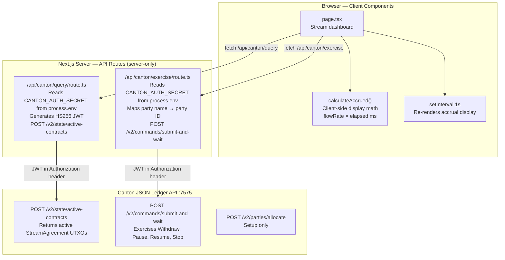
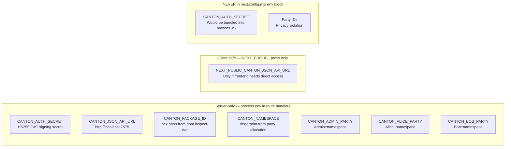
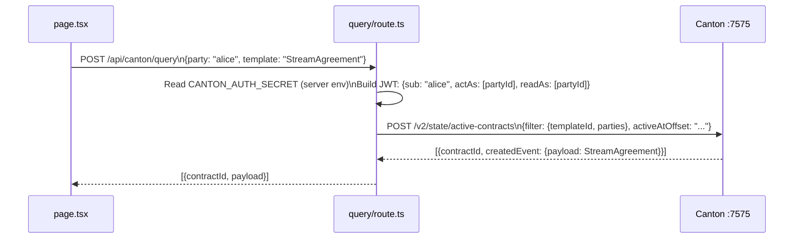
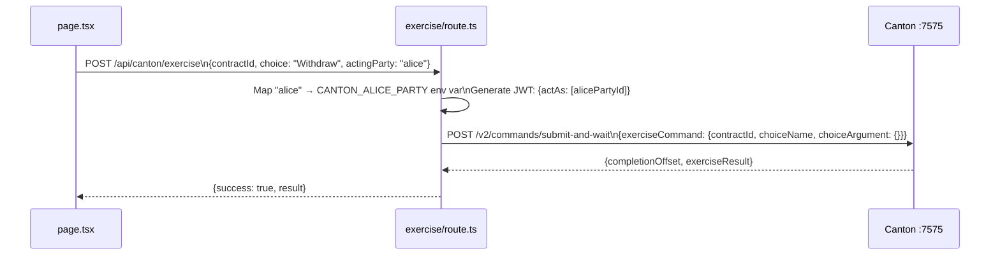

# GrowStreams — Frontend

> Next.js 14 dashboard for the GrowStreams streaming protocol. Queries live Canton contracts, displays real-time accrual, and submits lifecycle choices through Canton's JSON Ledger API.

**Framework**: Next.js 14 (App Router) · **Styling**: TailwindCSS · **Canton API**: port 7575

---

## Architecture



---

## Project Structure

```
canton-frontend/
├── app/
│   ├── page.tsx                   # Main dashboard — stream list, accrual display
│   ├── layout.tsx                 # Root layout + global metadata
│   ├── globals.css
│   └── api/canton/
│       ├── query/
│       │   └── route.ts           # Server route: query active contracts
│       └── exercise/
│           └── route.ts           # Server route: exercise choices
├── lib/
│   └── canton-api.ts              # Client helpers (calculateAccrued, formatTimeRemaining)
├── next.config.mjs                # Only NEXT_PUBLIC_ vars exposed to browser
├── .env.local                     # Local secrets — never committed
├── env.example                    # Template for .env.local
├── package.json
├── tsconfig.json
└── tailwind.config.ts
```

---

## Environment Variables



**Rule**: Server-side `process.env.CANTON_*` reads inside `app/api/canton/*/route.ts` are safe. Anything added to the `env:` block in `next.config.mjs` becomes a public browser constant.

---

## Setup

### Prerequisites

- Node.js 18+
- Canton sandbox running (`dpm sandbox --project-root ../daml-contracts`)

### Install

```bash
cd canton-frontend
npm install
```

### Configure

```bash
cp env.example .env.local
```

Edit `.env.local`:

```env
# Canton JSON Ledger API
CANTON_JSON_API_URL=http://localhost:7575

# JWT auth — HS256 secret for sandbox (replace with RS256/OAuth2 for production)
CANTON_AUTH_SECRET=your-dev-secret-here

# Package hash — from: dpm damlc inspect-dar --json ../.daml/dist/growstreams-1.0.0.dar | jq .main_package_id
CANTON_PACKAGE_ID=<hex-hash>

# Namespace fingerprint — from the party IDs returned by /v2/parties/allocate
CANTON_NAMESPACE=<fingerprint>

# Party IDs — from: curl localhost:7575/v2/parties/allocate
CANTON_ADMIN_PARTY=Admin::<fingerprint>
CANTON_ALICE_PARTY=Alice::<fingerprint>
CANTON_BOB_PARTY=Bob::<fingerprint>
```

### Run

```bash
npm run dev
# Open http://localhost:3000
```

---

## API Routes

### `POST /api/canton/query`

Queries active `StreamAgreement` contracts visible to the given party.



**Key**: `readAs` is scoped to the single requesting party. Never set `readAs` to all parties — that violates Canton's privacy model.

### `POST /api/canton/exercise`

Exercises a choice on a `StreamAgreement` or `StreamFactory` contract.



---

## Client-Side Accrual Display

The displayed accrual balance updates every second without making any network requests. This mirrors the on-ledger `calculateAccrued` formula:

```typescript
// lib/canton-api.ts
export function calculateAccrued(stream: StreamAgreement): number {
  if (stream.status !== "Active") return 0;
  const now = Date.now();
  const lastUpdate = new Date(stream.lastUpdate).getTime();
  const elapsedSeconds = (now - lastUpdate) / 1000;
  const accrued = stream.flowRate * elapsedSeconds;
  const available = stream.deposited - stream.withdrawn;
  return Math.min(accrued, available);
}
```

This is **display-only math**. The authoritative value is always computed on-ledger via `getTime` when a choice is exercised.

---

## Security Checklist

| Item | Status | Notes |
|---|---|---|
| `CANTON_AUTH_SECRET` in `.env.local` only | Required | Must not be in `next.config.mjs` |
| JWT generated server-side only | Required | Never in client-side code |
| `readAs` scoped to acting party | Required | One party per request |
| `actAs` mapped from env vars | Required | Never trust client-supplied party IDs |
| `.env.local` in `.gitignore` | Required | Verify before pushing |
| Production: RS256 / OAuth2 | Recommended | Replace HS256 for non-sandbox |

---

## Build and Deploy

```bash
# Production build
npm run build

# Start production server
npm start

# Lint
npm run lint
```

---

## Planned Improvements

- Replace `canton-api.ts` with `openapi-fetch` typed client generated from the Canton JSON API OpenAPI spec
- Add stream creation UI (create `StreamProposal` → `AcceptStream` flow)
- Add GrowToken balance display (query `GrowToken` UTXOs per party)
- WebSocket / SSE for real-time contract event updates
- RS256 / OAuth2 token exchange (Keycloak or Auth0)
- CIP-0103 wallet connectivity via dApp SDK + Discovery Component

---

**Version**: 1.0.0 · **Framework**: Next.js 14 · **Last Updated**: April 2026
