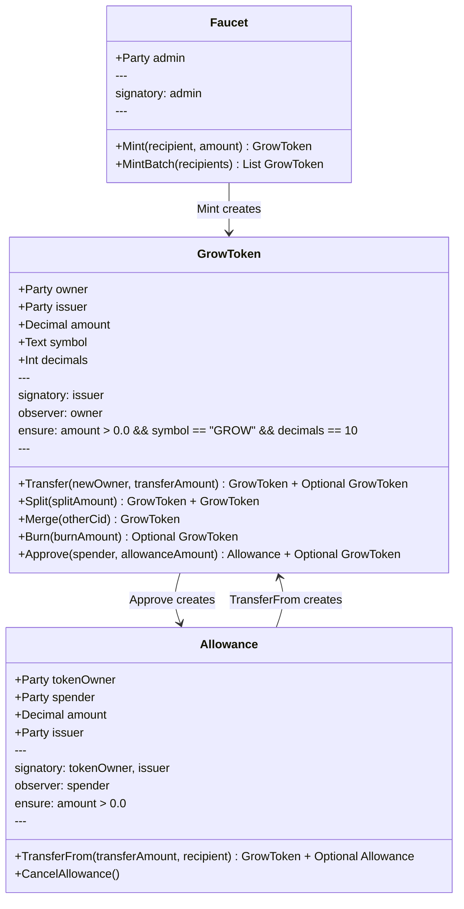
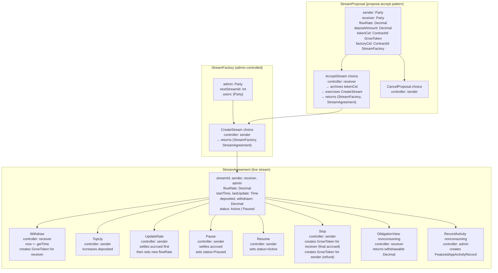

# GrowStreams — Daml Contracts

> Production DAR package for the GrowStreams streaming protocol on Canton Network.

**SDK**: Canton 3.4 / DPM · **Package**: `growstreams-1.0.0.dar`

This package contains the three production Daml modules that are compiled into a DAR and uploaded to the Canton ledger. Test scripts live in the sibling `../daml-contracts-tests/` package and are never deployed.

---

## Package Contents

```
daml-contracts/
├── daml.yaml                    # sdk-version: 3.4.0 — no daml-script dependency
└── daml/
    ├── GrowToken.daml           # Fungible GROW token (Transfer/Split/Merge/Burn/Approve)
    ├── StreamCore.daml          # Streaming engine (StreamAgreement/Factory/Proposal)
    └── FeaturedAppActivity.daml # CIP-0047 activity marker stub
```

---

## Contract Reference

### GrowToken.daml

The GROW token is a Canton-native fungible token following the UTXO model. Every token movement creates a new contract and archives the old one — there is no shared mutable balance.



**UTXO conservation in `Approve`**:
```daml
choice Approve : (ContractId Allowance, Optional (ContractId GrowToken))
  with spender : Party; allowanceAmount : Decimal
  controller owner
  do
    assertMsg "Allowance must be positive" (allowanceAmount > 0.0)
    assertMsg "Insufficient balance for allowance" (amount >= allowanceAmount)
    allowanceCid <- create Allowance with
      tokenOwner = owner; spender = spender
      amount = allowanceAmount; issuer = issuer
    remainder <- if amount > allowanceAmount
      then do
        remCid <- create this with amount = amount - allowanceAmount
        return (Some remCid)
      else return None
    return (allowanceCid, remainder)
```

The caller always gets back either `None` (exact spend) or `Some remainderCid` (change). No tokens are ever lost.

---

### StreamCore.daml

The core streaming engine. Three templates work together:



#### `calculateAccrued` — the accrual engine

```daml
calculateAccrued : StreamAgreement -> Time -> Decimal
calculateAccrued stream currentTime =
  if stream.status /= Active then 0.0
  else
    let elapsed        = subTime currentTime stream.lastUpdate
        elapsedSeconds = relTimeToSeconds elapsed
        accrued        = stream.flowRate * elapsedSeconds
        available      = stream.deposited - stream.withdrawn
    in if accrued > available then available else accrued
```

This function is **pure** (no side effects). It is called from inside every consuming choice after `now <- getTime`.

#### Key invariants enforced in `ensure`

```daml
ensure flowRate > 0.0
    && deposited >= 0.0
    && withdrawn >= 0.0
    && withdrawn <= deposited
```

Every choice that modifies `withdrawn` or `deposited` must produce a new `StreamAgreement` that satisfies this `ensure` clause, or the entire transaction is rejected by the ledger.

---

### FeaturedAppActivity.daml

A stub template for CIP-0047 activity markers. Currently emits local contracts visible only to `provider`.

**Production path**: Replace this module with a `data-dependency` on `splice-amulet-<version>.dar` and use the real `FeaturedAppActivityMarker` template. See `../README.md` Fix R-7 for the migration steps.

```daml
template FeaturedAppActivityRecord
  with
    provider     : Party
    activityType : Text    -- "stream_created" | "stream_withdraw" | "stream_stopped"
    referenceId  : Text    -- stream ID for correlation
    timestamp    : Time
  where
    signatory provider
```

---

## Build

```bash
# From repo root
dpm build --project-root daml-contracts

# Or with all packages in topological order
dpm build --all
```

Output: `daml-contracts/.daml/dist/growstreams-1.0.0.dar`

Get the package hash (needed for frontend `CANTON_PACKAGE_ID`):

```bash
dpm damlc inspect-dar --json daml-contracts/.daml/dist/growstreams-1.0.0.dar \
  | jq .main_package_id
```

---

## Daml Syntax Reference

Critical patterns used throughout this codebase:

### Time — always use `getTime`, never accept `Time` as argument

```daml
-- CORRECT
choice Withdraw : (ContractId StreamAgreement, Decimal)
  controller receiver
  do
    now <- getTime           -- ledger-assigned time
    let withdrawable = calculateAccrued this now
    ...

-- WRONG — caller can supply any time value
choice Withdraw : (ContractId StreamAgreement, Decimal)
  with currentTime : Time   -- security vulnerability
  controller receiver
  do ...
```

### Template structure

```daml
template MyContract
  with
    field1 : Party       -- no commas between fields
    field2 : Decimal
  where
    signatory field1
    observer field2      -- if field2 is a Party
    ensure field2 > 0.0  -- single ensure clause using &&
```

### Consuming vs nonconsuming choices

```daml
-- Consuming (default): archives the contract
choice Transfer : ContractId GrowToken
  with newOwner : Party
  controller owner
  do create this with owner = newOwner

-- Nonconsuming: contract remains active
nonconsuming choice ObligationView : Decimal
  with currentTime : Time
  controller receiver
  do return (calculateAccrued this currentTime)
```

### UTXO pattern — always return remainder

```daml
-- If consuming part of a token, always create a remainder UTXO
remainder <- if amount > transferAmount
  then do
    remCid <- create this with amount = amount - transferAmount
    return (Some remCid)
  else return None
```

### Common type errors

| Wrong | Right |
|---|---|
| `Float` | `Decimal` |
| `Text` for parties | `Party` |
| Multiple `ensure` clauses | Single `ensure` with `&&` |
| `this.fieldName` | `fieldName` (direct access in `where` block) |
| `controller` before `with` | `with` before `controller` in choice |
| `createCmd` inside a choice | `create` inside a choice |

---

## daml.yaml

```yaml
sdk-version: 3.4.0
name: growstreams
version: 1.0.0
source: daml
dependencies:
  - daml-prim
  - daml-stdlib
```

Note: `daml-script` is intentionally absent. Test scripts live in `../daml-contracts-tests/` which has its own `daml.yaml` with `daml-script` and a `data-dependencies` entry pointing at this DAR.

---

## Uploading to a Canton Node

```bash
# Get a JWT token first (sandbox: no auth needed in dev mode)
TOKEN=$(curl -s http://localhost:7575/v2/...) # or generate HS256 JWT

# Upload DAR
curl -X POST http://localhost:7575/v2/packages \
  -H "Authorization: Bearer $TOKEN" \
  -H "Content-Type: application/octet-stream" \
  --data-binary @.daml/dist/growstreams-1.0.0.dar
```

---

**Version**: 1.0.0 · **SDK**: Canton 3.4 · **Last Updated**: April 2026
